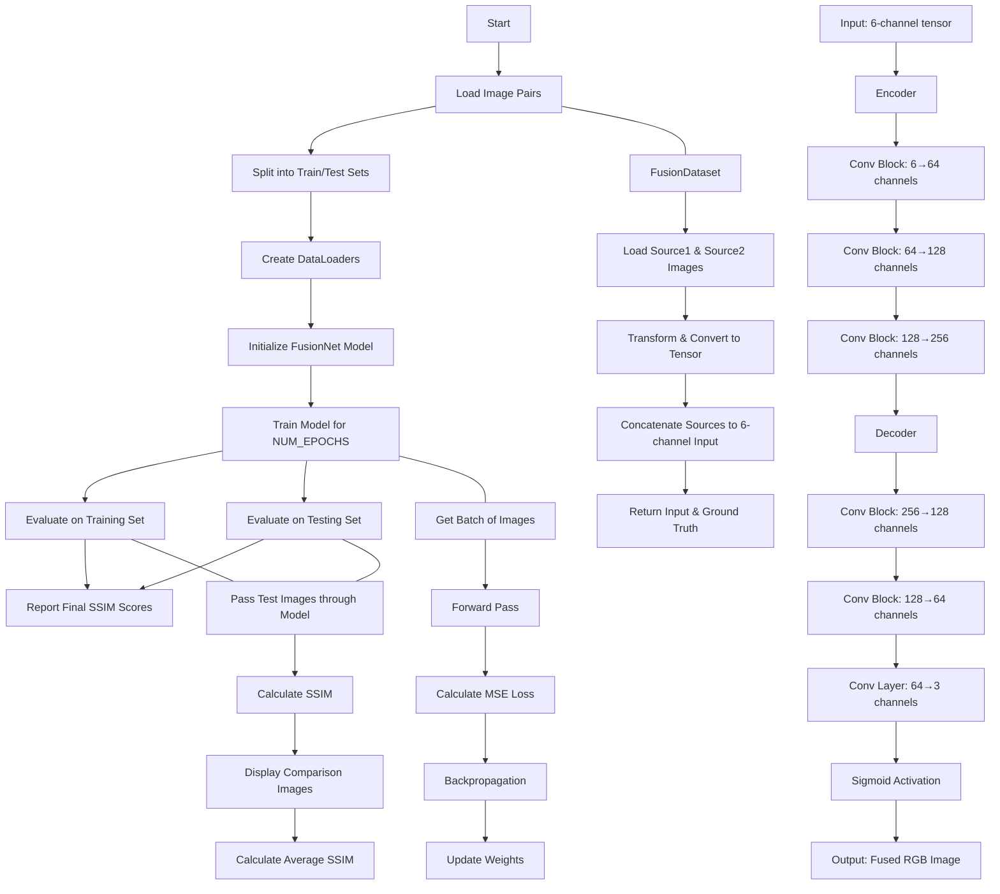

# Multi-Focus-Image-Fusion-Using-Pytorch
This project is part of an internship where our team worked on developing a deep learning-based image fusion solution. The goal was to fuse two source images into a high-quality output, combining the best details of both inputs. The journey to the final solution was a process of continuous learning, experimentation, and integration of classical research methods.

[Click here to view the implementation on Kaggle](https://www.kaggle.com/code/jayaanth/multi-focus-image-fusion-using-pytorch)

## Overview

The project began with an investigation of traditional image fusion methods and evolved into a robust deep learning solution. We explored various techniques, evaluated their strengths and limitations, and finally adopted an encoder-decoder network (dubbed **FusionNet**) to perform the fusion task.

## Flowchart

## Research and Initial Exploration

### Classical Methods
- **Gaussian Method:**  
  - Utilized Gaussian pyramids to blend images at multiple scales.
  - Pros: Computationally efficient and straightforward.
  - Cons: Often resulted in blurred outputs and loss of fine details.

- **Laplacian Pyramid:**  
  - Built on Gaussian pyramids to capture edge and detail information.
  - Pros: Preserved more details than the Gaussian method.
  - Cons: Highly sensitive to noise and required extensive parameter tuning.

- **Wavelet-Based Approaches:**  
  - Decomposed images into frequency components to fuse high-frequency and low-frequency features separately.
  - Pros: Potential for capturing both global and local features.
  - Cons: Complexity in choosing the appropriate wavelet basis and fusion rules.

### Transition to Deep Learning
The limitations observed in classical methods led us to explore a learning-based approach using Convolutional Neural Networks (CNNs). Initial prototypes were challenging due to:
- Inconsistent image preprocessing and data dimension issues.
- Shallow network architectures that failed to capture complex, multi-scale features.

## Developing the Deep Learning Solution

## Dataset

### MFI-WHU Image Dataset

The **MFI-WHU** dataset is a benchmark designed for multi-focus image fusion. It was synthetically constructed by combining and processing images from public datasets. Key characteristics include:

- **Composition:**  
  Consists of 120 image pairs. Each pair includes two source images—one representing the focused region and the other representing the defocused (blurred) area—as well as the corresponding full-clear image that serves as ground truth.

- **Synthetic Construction:**  
  Rather than being captured directly with a multi-focus camera system, the dataset was generated using image processing techniques (e.g., Gaussian filtering) on segmented clear images. This approach expands the available data volume for fusion evaluation, although the resulting scenarios are relatively simple compared to real-world captured images.

- **Usage:**  
  Widely employed as a benchmark for evaluating multi-focus image fusion algorithms, the MFI-WHU dataset provides a controlled environment to assess how well fusion methods can recover detailed information from partially focused images.

---

### Model Architecture: FusionNet
- **Encoder:**  
  Processes the 6-channel concatenated input, extracting deep, multi-scale features.
- **Decoder:**  
  Reconstructs these features into a 3-channel fused image using multiple convolutional blocks and a final Sigmoid activation to scale pixel values between 0 and 1.
- **Modular Design:**  
  The use of helper convolutional blocks allowed for easier experimentation and fine-tuning of network parameters.

---

### Evaluation Metric: Structural Similarity Index (SSIM)

For assessing the quality of our multi-focus image fusion results, we rely on the **Structural Similarity Index (SSIM)**. SSIM is widely used in image processing because it measures the perceived similarity between two images in terms of luminance, contrast, and structural information. Key points include:

- **Perceptual Relevance:**  
  SSIM compares local patterns of pixel intensities that have been normalized for luminance and contrast, making it well suited for evaluating how closely the fused image matches the clear, ground-truth image.

- **Computation:**  
  The metric is computed over local windows (typically using a sliding window approach), and then the local SSIM values are averaged to yield a global similarity score that ranges from 0 to 1. A score closer to 1 indicates a higher similarity and better fusion quality.

- **Robustness:**  
  Since SSIM takes into account changes in structural information rather than simply pixel-by-pixel differences, it correlates better with human visual perception than traditional metrics such as Mean Squared Error (MSE) or Peak Signal-to-Noise Ratio (PSNR).

In our experiments, SSIM is computed for each fused image relative to its corresponding full-clear (ground-truth) image, and the average SSIM score across the dataset serves as a quantitative indicator of the overall fusion performance.

---

### Evaluation and Iterative Refinement
- **Loss Function:**  
  The Mean Squared Error (MSE) loss was used to train the network.
- **Evaluation Metric:**  
  The Structural Similarity Index (SSIM) was integrated to quantitatively assess the perceptual quality of the fused images.
- **Visualization:**  
  Side-by-side comparisons of source images, the fused output, and the ground truth provided critical feedback for model improvement.

## Final Outcome

After weeks of iterative improvements, the final solution demonstrated:
- **Adaptive Feature Learning:**  
  The network learned the optimal fusion strategy from the data, overcoming the limitations of traditional methods.
- **Improved Detail Preservation:**  
  The encoder-decoder architecture effectively balanced between capturing fine details and smoothing artifacts.
- **Robustness:**  
  The model showed improved resistance to noise, a challenge often seen in classical wavelet-based methods.

  

## Reflection

This project was a journey of exploration and continuous improvement. The integration of insights from classical methods (like Gaussian, Laplacian, and wavelet approaches) with the power of deep learning provided a comprehensive solution to the image fusion problem. The experience highlighted the importance of a methodical approach, extensive experimentation, and the willingness to iterate until the right balance of performance and robustness was achieved.

---

